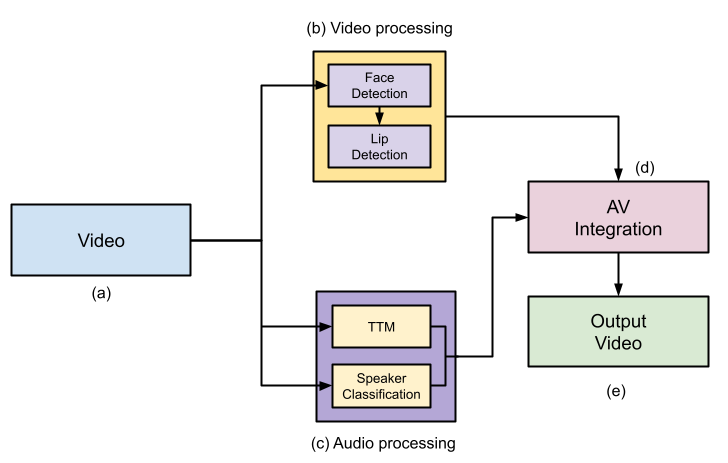

# ECHO: Enhanced Communication for Hearing Impaired in Online Podcasts

ECHO is a groundbreaking system designed to make online podcasts accessible for hearing-impaired individuals. This project identifies and visualizes the active speaker 🗣️, synchronizes subtitles 📝, and even provides Hindi translations 🇮🇳 for enhanced inclusivity.  

🖋️ **Presented at:**  
**ACM 8th International Conference on Data Science and Management of Data (CODS COMAD)**  
📅 **Date:** December 18–21, 2024  
📍 **Location:** IIT Jodhpur, India  

---

## ✨ Features
- 🗣️ **Speaker Identification**: Detects the active speaker in a video using lip movement and audio analysis.  
- 📝 **Subtitle Synchronization**: Automatically generates synchronized subtitles.  
- 🎥 **Multimodal Integration**: Combines **video** (face and lip movement detection) with **audio** (speech transcription and speaker classification).  
- 🌐 **Hindi Translations**: Automatically translates English subtitles into Hindi for better accessibility.  
- 📂 **Benchmark Dataset**: Includes 500 annotated videos, diverse in accents and genres, tailored for speaker identification.  

---

## 🛠️ Architecture Overview
ECHO integrates state-of-the-art models for seamless functionality:  
### 📹 **Video Processing**  
- **Face Detection**: [MTCNN](https://arxiv.org/abs/1604.02878) detects faces with high accuracy.  
- **Lip Movement Detection**: [LipNet](https://arxiv.org/abs/1611.01599) analyzes lip movements for speaker identification.  

### 🎙️ **Audio Processing**  
- **Speech Transcription**: Powered by OpenAI’s [Whisper](https://github.com/openai/whisper).  
- **Speaker Embeddings**: Extracted with [Wav2Vec 2.0](https://arxiv.org/abs/2006.11477).  
- **Clustering**: Groups speaker data for robust classification.  

### 🔗 **Integration**  
- Syncs video and audio streams in real-time for seamless output.  
- Bounding boxes and color-coded speakers make the experience intuitive.

  
*Figure: Block diagram of the ECHO architecture.*

---

## 📊 Evaluation
The system excels across multiple benchmarks:  
- 🏆 **Word Error Rate (WER)**: 5.3% – delivering accurate transcriptions.  
- 🏆 **Speaker Error Rate (SER)**: 9.2% – ensuring precise speaker classification.  

### 🔍 Ablation Studies
- Integration of **audio and video models** improves accuracy by 8%.  
- Incorporating **lip detection** reduces synchronization errors by 4%.

---

## 📂 Dataset
The dataset includes:  
- 🎥 500 conversation videos, annotated with English subtitles in `.srt` format.  
- 🌐 Designed for diverse accents and genres.  
- 📥 **[Download a sample of the dataset here](https://drive.google.com/drive/folders/1-5IJ-gzepjWvkoEkowTQfArjBg2QZD_A?usp=drive_link)**.  

---

## 🚀 Usage
### ⚙️ Prerequisites  
- Python 3.8 or higher  
- Required libraries: `torch`, `transformers`, `opencv-python`, `librosa`, `scikit-learn`

### 🔧 Installation
1. Clone the repository:  
   ```bash
   git clone https://github.com/your-repo/echo.git
   cd echo
2. Install dependencies:
    ```bash
    pip install -r requirements.txt
### ▶️ Running the Model
1. Place input videos in the data/input directory.
2. Process videos
    ```bash
    python main.py --input data/input --output data/output
3. Output videos with subtitles will be saved in the data/output directory. 🎉
---
## 🏅 Results
The system supports multiple video genres:

- 🎙️ Talk shows: WER 9.0%, SER 10.3%
- 🎤 Interviews: WER 8.5%, SER 9.5%
- 🗳️ Political debates: WER 5.1%, SER 9.0%
---
## 📜 Citation
If you use this work in your research, please cite:
```
@inproceedings{godhala2024echo,
  title={ECHO: Enhanced Communication for Hearing Impaired in Online Podcasts},
  author={Gouthami Godhala, Vijayasree Asam, Samriddha Sanyal},
  booktitle={Proceedings of the 8th International Conference on Data Science and Management of Data (CODS-COMAD)},
  year={2024},
  doi={10.1145/3703323.3703345}
}
```
## 🙏 Acknowledgments
This project was supported by the **Centre for Interdisciplinary Artificial Intelligence (CAI), FLAME University.**

## 👥 Contributors  
- **Gouthami Godhala** ([GitHub Profile](https://github.com/gouthamireddy2507))  
- **Vijayasree Asam** ([GitHub Profile](https://github.com/vijayasree1284))  
- **Samriddha Sanyal**
